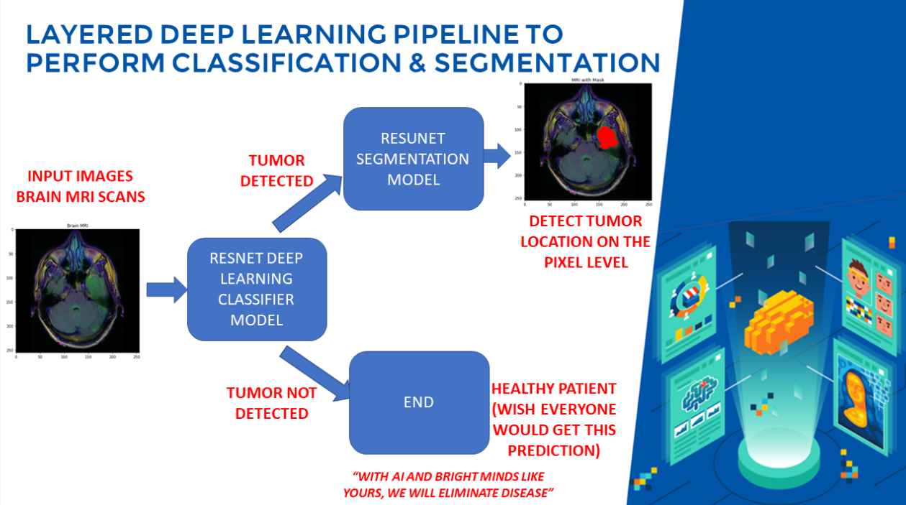
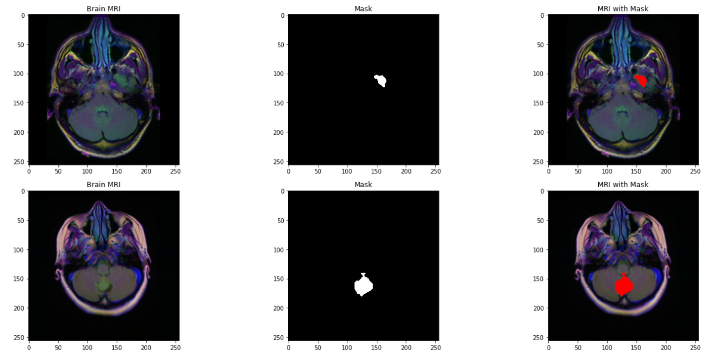

---

# 🩺 Healthcare AI — Brain MRI Segmentation

This repository contains a Jupyter Notebook that demonstrates how **Artificial Intelligence** can be applied to **medical imaging**—specifically brain MRI scans—to identify and segment tumor regions. The project walks through problem understanding, data preprocessing, model development, and evaluation.

---


## 📌 Project Overview

Medical imaging plays a critical role in early diagnosis and treatment planning. This project uses a dataset of brain MRI images to train a deep learning model capable of segmenting tumors.
The notebook includes:

1. **Understanding the Problem** – Context, business case, and industry applications.
2. **Data Import & Preprocessing** – Loading MRI scan data, visualizing it, and preparing it for modeling.
3. **Model Training** – Implementing a convolutional neural network (CNN) for image segmentation.
4. **Model Evaluation** – Assessing accuracy, dice scores, and visualizing predictions.
5. **Conclusions** – Insights into performance and possible improvements.

---
## 📊 Project Workflow



---

## 🧠 Tumor Segmentation Process


## 📂 Dataset

* **Source:** [Kaggle — LGG MRI Segmentation Dataset](https://www.kaggle.com/mateuszbuda/lgg-mri-segmentation)
* Below is a sample of the MRI images and corresponding segmentation masks:

* Contains T1-weighted contrast-enhanced brain MRI scans with tumor masks.

---

## 🛠️ Technologies Used

* **Python** (Jupyter Notebook)
* **TensorFlow / Keras** – Deep Learning Framework
* **NumPy & Pandas** – Data Handling
* **Matplotlib & Seaborn** – Visualization
* **OpenCV** – Image Processing

---

## 🚀 Getting Started

### 1️⃣ Clone the Repository

```bash
git clone https://github.com/jowin-henry/Brain-Tumor-Detection-and-Segmentation.git
cd Brain-Tumor-Detection-and-Segmentation
```

### 2️⃣ Install Dependencies

It’s recommended to use a virtual environment:

```bash
pip install -r requirements.txt
```

### 3️⃣ Run the Notebook

```bash
jupyter notebook Healthcare_AI.ipynb
```

---

## 📊 Results

* Achieves accurate segmentation of tumor regions on MRI scans.
* Visualizes predicted masks against ground truth for qualitative assessment.

---

## 📜 License

This project is licensed under the MIT License — see the [LICENSE](LICENSE) file for details.

---

## 🙌 Acknowledgements

* Dataset provided by **Mateusz Buda** on Kaggle.
* Medical imaging research resources from [AI Multiple](https://research.aimultiple.com).

---

If you want, I can also **scan your notebook for model architecture details and actual performance metrics** so we can make the README more impressive with real numbers and example outputs. That would make it look more professional for GitHub.
